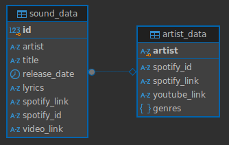

# EfMobi README

## Важные действия

**Запуск проекта**

```bash
cd <директория проекта>
docker-compose up --build
```

**Ссылка на Swagger UI** - [http://localhost:8080](http://localhost:8080/#/)

---

## Запуск/Docker

Всё решение загнано в **Docker,** чтобы запустить проект достаточно перейти в директорию проекта и в терминале прописать следующую команду

```bash
docker-compose up --build
```

Всего в проекте 4 контейнера

- **main_db** - контейнер базы данных Postgres, данные для авторизации в информационной системе, например DBeaver, можно найти в “корневом” .env файле
- **go_local** - контейнер Golang Gin-Gonic API, к которому мы будем обращаться, через **Swagger, Insomnia** или банальный **curl**. Основной рабочий контейнер, весь код - тут
- **go_outer** - ещё один контейнер Golang Gin-Gonic API, это внутрисервисные API, они не предназначены для клиентских обращений, но, при желании, вам ничего не помешать обратиться к ним через **curl** (в сваггере они не указаны)
    - Я решил немного намудрить в этой работе, поэтому в этом, наверное можно даже сказать, микросервисе происходит обращение с **Spotify Web API** (речь о них будет позже)
- **swagger-ui** - последний контейнер, в котором крутится **Swagger**, работает по следующей ссылке - [http://localhost:8080](http://localhost:8080/#/)

---

## База данных

Схема базы данных (Postgres) неприлично простая, две таблицы с внешним ключом между ними. Как и требуется по заданию, создания схемы БД происходит при помощи миграции моделей при запуске контейнеров. Обращение к БД происходит через **ORM** (библиотека GORM), поэтому ни о каких SQL инъекциях мы можем не переживать



Схема БД

В проекте реализована автоматическая инициализация базы данных посредством стороннего файла **init.sql.** Это процесс отключен, так как по заданию требуется не это. Однако если раскоментировать строки 16-17 в **docker-compose.yaml**

```yaml
16 - # volumes:
17 -    #   - ./init.sql:/docker-entrypoint-initdb.d/init.sql
```

---

## Клиентские API

Апишек получилось немного, все, что надо было сделать по заданию и парочку сверху. По логике нужно было бы сделать побольше апишек для исполнителей, но у меня не хватило времени (в последний день померла **Ubuntu**).

**Древо эндпоинтов:**

- **http://localhost:7557/api**
    - **/ping** - Проверка сервиса на работоспособность. Ручка безобидна, можно дергать сколько угодно
    - **/execute_dml** - Ручка позволяет автоматически заполнить базу данных предопределенными данными
    - **/sound** - Группа апишек для треков
        - **/info** - Получение информации о треке/списке треков с одинаковым названием
        - **/whole_lib** - Получение информации о всей музыкальной библиотеке с пагинацией и фильтрацией по всем полям базы данных. **Важное уточнение** - после окончательной апробации убрал фильтрацию по дате, вылетает ошибка
        - **/delete** - Удаление трека по названию и исполнителю
        - **/add_track** - Ручка для добавления нового трека в библотеку. Апишка, благодаря **английскому бесплатному прокси**, раз в год при полной луне может сходить к Spotify Web API и запросить более полную и корректную информацию о добавляемом треке. Если срабатывает какая-то ошибка, и запрос к Spotify невозможен, в БД будет добавлена информация, переданная пользователем. В том числе может произойти добавление исполнителя в соответствующую таблицу БД, если он уже там не находится.
        - **/lyrics** - Программа извлекает текст песни из базы данных и, если переменная limit или offset задана, извлекает определенное количество строк. Так как текст песни может быть не разбит на куплеты/припевы/бриджи пустыми строками, программа считает, что новая строка всегда начинается с большой буквы. Поэтому в данном случае происходит пагинация не по пустым строкам, обозначающих новую часть текста, а по строкам с заглавными буквами
        - **/sound** - Обновление информации о существующем треке
    - **/artist/info** - подразумевалось, что это будет группа апишек, но что-то не вышло. Вывод информации об исполнителях
        - Стоит уточнить, что апишки для добавления нового артиста нет. Запись о новом артисте создаётся при добавлении пользователем нового трека, в случае если такого исполнителя не существовало

Более полная информация и возможность протестировать сервис по ссылке - [http://localhost:8080](http://localhost:8080/#/)

---

## Spotify Web API

В этой работе я решил немножко намутить мути. Сразу прошу прощения, что усложнил этим проект, хотя вы просили так не делать (вроде).

Так как пользователь, допустим при добавлении нового трека, может написать туда какую-угодно информацию, например Пророк Санбой - Рассказ про Кюш Баран Кюш, что не особо походит на трек, я решил добавить некоторый механизм нормализации записей. Обучать свою модель, которая будет искать полученное название трека в какой-то внепроектной базе треков - очевидный оверкилл. Поэтому я решил настроить обращение к **Spotify Web API.**

Задача достаточно простая - поиск записей в базе Spotify по названию трека и имени артиста. Если наш сервис получает какую-то полезную информацию от этого обращения, то информация, полученная от пользователя, замещается и дополняется новой. Эта информация используется, в том числе, и при создании добавлении новой записи об артисте

Ссылка на документацию - [https://developer.spotify.com/documentation/web-api/reference/search](https://developer.spotify.com/documentation/web-api/reference/search)

Но! У вас может возникнуть вопрос - “а спотифай, разве, не ушел из России?”. Ответ - ушёл (к сожалению). Я это предусмотрел, обращение к Spotify Web API происходит через прокси, однако, так как это бесплатный прокси, обращение может быть достаточно долгим. Но зачастую его может не быть вообще. В случае, если время запроса исходит, прокси отваливается или сервис теряет соединение с Web API, занесение информации о новом треке осуществляется с использованием пользовательской информации, какой-бы некорректной, странной или провокационной она ни была.

---

## Внутрисервисные API

Как уже было сказано, у пользователя нет доступа к этим API, если мы подразумеваем, что пользователь не умеет писать **curl** простейшие запросы. В сваггере эти ручки не описаны, но упоминуть их всё таки стоит

- **http://localhost:7558/**
    - **/token** - Получение временного **Access Token (API Key)** для авторизации обращений к Spotify Web API
    - **/search_track** - Обращение к Spotify Web API для получения валидной информации о треке ([https://developer.spotify.com/documentation/web-api/reference/search](https://developer.spotify.com/documentation/web-api/reference/search))

---

## Swagger UI

Тут рассказывать особо не о чем. Просто он работает по ссылке - [http://localhost:8080](http://localhost:8080/#/). Контент расписан в файле **openapi.yaml**